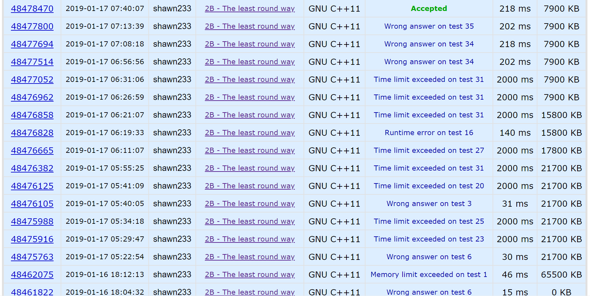

# Codeforces 2B The least round way

## Problem

There is a square matrix $n \times n$, consisting of non-negative integer numbers. You should find such a way on it that

- starts in the upper left cell of the matrix;
- each following cell is to the right or down from the current cell;
- the way ends in the bottom right cell.

Moreover, if we multiply together all the numbers along the way, the result should be the least "round". In other words, it should end in the least possible number of zeros.

**Input**

The first line contains an integer number *n* ($2\le n\le 1000$), *n* is the size of the matrix. Then follow *n* lines containing the matrix elements (non-negative integer numbers not exceeding 109).

**Output**

In the first line print the least number of trailing zeros. In the second line print the correspondent way itself.

## Idea

Intuition: 乘积末尾的$0$最少，意味着该乘积包含的$10$最少。$10=2\times 5$，因此我们只需要找到一条路径，使得这条路径上的数，因式分解出的$2$或$5$最少。

Idea: 首先把矩阵`a`里每个数包含的$2$和$5$的个数求出来，保存在两个矩阵里（`a2`和`a5`）。对这两个矩阵，分别用动态规划的方式分别找到：

* $2$最少的路径，对`a2`用dp得到；
* $5$最少的路径，对`a5`用dp得到；

将两条路径比较，取其中2或5的个数较少的那一条。

## Trap

* 0的特殊处理：题目中提到，矩阵元素的值非负，意味着值可以为$0$。因此，如果矩阵中出现$0$，我们就已经找到了一条乘积末尾只有$1$个$0$的路径（任意经过该位置的路径）。但注意，这并不意味着我们找到了最终结果，因为有可能还存在乘积末尾无$0$的路径。为了找到末尾无$0$的路径，**我们需要把0替换为10**，这样就不会对无0路径产生影响；
* 程序优化：这道题限时2s，限内存64MB。在提交中，发现$n=1000$时的运行时间接近2s，因此作出以下优化，将运行时间降至200ms左右：
  * 减少内存访问次数：删除不必要的大矩阵（从7个降低至2个）；
  * 空间局部性优化：将对同一个矩阵的操作放到一起；避免大量跨行操作（降低cache miss rate）；
  * 取代复杂函数：用`scanf`和`printf`替换`cin`和`cout`。

## Answer



```c++
#include <iostream>
#include <cstdio>
#define MAX_N 1005

using namespace std;

void find_path (int path[MAX_N][MAX_N], int n) {
    int i, j, ind;
    char ans[2*MAX_N];
    i = j = n;
    ind = 2 * n;
    ans[ind --] = '\0';
    while (i != 0 || j != 0) {
        if (i == 0) {
            while (j != 0) {
                ans[ind --] = 'R';
                -- j;
            }
        } else if (j == 0) {
            while (i != 0) {
                ans[ind --] = 'D';
                -- i;
            }
        } else if (path[i-1][j] < path[i][j-1]) {
            ans[ind --] = 'D';
            -- i;
        } else {
            ans[ind --] = 'R';
            -- j;
        }
    }
    printf ("%s\n", ans);
}

int main () {
    int n, x;
    int a2[MAX_N][MAX_N]; // num of 2 in a
    int a5[MAX_N][MAX_N]; // num of 5 in a
    bool zero_flag = false;
    int zero_i, zero_j;

    cin >> n;
    for (int i = 0; i < n; ++ i) {
        for (int j = 0; j < n; ++ j) {
            scanf ("%d", &x);
            if (x == 0) {
                // TRAP HERE!!!! non-negative inputs, meaning 0's may occur
                // if 0 occurs, the loops below will not quit !!!
                if (!zero_flag) {
                    zero_i = i;
                    zero_j = j;
                }
                zero_flag = true;
                a2[i][j] = a5[i][j] = 1;
                continue;
            }
            a2[i][j] = a5[i][j] = 0;

            while ((x & 1) == 0) {
                x = (x >> 1);
                ++ a2[i][j];
            }

            while (x % 5 == 0) {
                ++ a5[i][j];
                x /= 5;
            }
        }
    }

    for (int i = 1; i < n; ++ i) {
        a2[0][i] += a2[0][i-1];
    }
    for (int i = 1; i < n; ++ i) {
        a2[i][0] += a2[i-1][0];
    }

    for (int i = 1; i < n; ++ i) {
        for (int j = 1; j < n; ++ j) {
            a2[i][j] += min (a2[i-1][j], a2[i][j-1]);
        }
    }

    for (int i = 1; i < n; ++ i) {
        a5[0][i] += a5[0][i-1];
    }
    for (int i = 1; i < n; ++ i) {
        a5[i][0] += a5[i-1][0];
    }
    for (int i = 1; i < n; ++ i) {
        for (int j = 1; j < n; ++ j) {
            a5[i][j] += min (a5[i-1][j], a5[i][j-1]);
        }
    }

    n -= 1;
    if (zero_flag && (min(a2[n][n], a5[n][n]) != 0)) {
        cout << 1 << endl;
        for (int t = 0; t < zero_j; ++ t)
            printf ("%c", 'R');
        for (int t = 1; t <= n; ++ t)
            printf ("%c", 'D');
        for (int t = zero_j+1; t <= n; ++ t) 
            printf ("%c", 'R');
        printf ("\n");
    } else {
        if (a2[n][n] < a5[n][n]) {
            cout << a2[n][n] << endl;
            find_path (a2, n);
        } else {
            cout << a5[n][n] << endl;
            find_path (a5, n);
        }
    }

    return 0;
}
```

