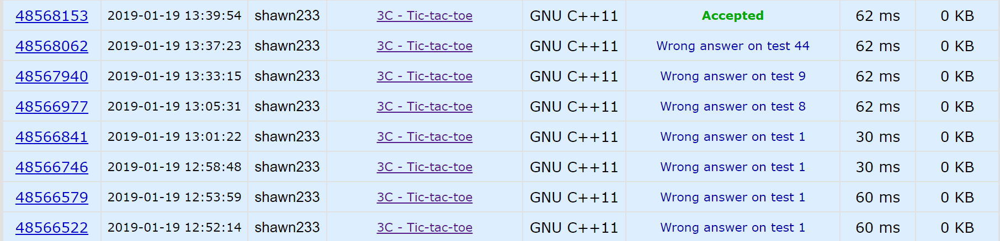

# Codeforces 3C Tic-Tac-Toe

## Problem

Certainly, everyone is familiar with tic-tac-toe game. The rules are very simple indeed. Two players take turns marking the cells in a $3\times 3$ grid (one player always draws crosses, the other — noughts). The player who succeeds first in placing three of his marks in a horizontal, vertical or diagonal line wins, and the game is finished. The player who draws crosses goes first. If the grid is filled, but neither Xs, nor 0s form the required line, a draw is announced.

You are given a $3\times 3$ grid, each grid cell is empty, or occupied by a cross or a nought. You have to find the player (first or second), whose turn is next, or print one of the verdicts below:

- `illegal` — if the given board layout can't appear during a valid game;
- `the first player won` — if in the given board layout the first player has just won;
- `the second player won` — if in the given board layout the second player has just won;
- `draw` — if the given board layout has just let to a draw.

**Input**

The input consists of three lines, each of the lines contains characters ".", "X" or "0" (a period, a capital letter X, or a digit zero).

**Output**

Print one of the six verdicts: `first`, `second`, `illegal`, `the first player won`, `the second player won` or `draw`.

## Idea

Intuition:  这道题在数据量上没有任何压力，因此采用暴力求解（brute force）。暴力求解的关键是弄明白这个游戏的规则。

* X先行，棋盘共9格，因此X的个数等于0的个数或比0的个数多1；

* 一方取胜时游戏结束。这一条就是这道题的坑。

  * 不能出现多次取胜。这一条指的是：不可以在棋盘的多处取胜。简单看来，如果我们统计了3连棋的组数，当组数大于2时就判为`illegal`。实际上这样做是错的。

  * 推论：在井字棋的合理棋局里，一方最多下5个棋子；

  * 推论：如果出现了因一方两次取胜而不合理的井字棋布局，则该棋局上两次取胜的一方最少要6个棋子。反证法：否则该棋局合理；因为此时这一方有5个棋子，可以让最后一个棋子下在两个3连棋的交界处。考虑如下棋局：

    X X X

    X O O

    X O O

    显然合理，因为可以让最后一子下在左上角，但出现了两组3连棋。

  * 结论：在井字棋中，只要棋子的个数合理，只可能出现两方同时取胜的非法情况，不可能出现一方多次取胜的非法情况。因此，在保证了棋子个数合理后，我们只需要保证只有一方取胜即可。

* 一方取胜后另一方不能再下。因此，X取胜则num_X == num_O + 1，O取胜则num_X == num_O。

总结一下，该题判`illegal`的条件有三个，满足其中一个即可：

* 棋子个数不合理（num_X != num_O && num_X - 1 != num_O）；
* 棋子个数合理，但两方同时取胜；
* 棋子个数合理，两方中仅一方取胜，但一方取胜后另一方还下了一个子。

**Trap**

* 数据初始化。计算中用到的数据，特别是用于累加的数据，一定要初始化为0.我建议在**申明时就进行初始化**。
* 规则制定题一定要结合例子想，尽量在现有的规则上举反例。
* 不要轻视任何一个问题。



```c++
#include <iostream>
#include <cstdio>

using namespace std;

int main () {
    char board [3][3];
    int num_x = 0, num_o = 0;
    char x = 'X', o = '0';
    bool x_win = false, o_win = false;

    for (int i = 0; i < 3; ++ i) 
        for (int j = 0; j < 3; ++ j)
            cin >> board [i][j];
    
    // count markers
    num_x = num_o = 0; // I made a mistake here. If the initial value is 
                       // not set, results will be unreliable.
    for (int i = 0; i < 3; ++ i) {
        for (int j = 0; j < 3; ++ j) {
            num_x = (board[i][j] == x)?(num_x + 1): num_x;
            num_o = (board[i][j] == o)?(num_o + 1): num_o;
        }
    }

    // illegal condition 1
    if ((num_x != num_o) && (num_x - 1 != num_o)) {
        cout << "illegal" << endl;
        return 0;
    }

    for (int i = 0; i < 3; ++ i) {
        if (board[i][0] != '.' && board[i][0] == board[i][1] && board[i][1] == board[i][2]) {
            if (board[i][0] == x)
                x_win = true;
            else 
                o_win = true;
        }
    }
    
    for (int i = 0; i < 3; ++ i) {
        if (board[0][i] != '.' && board[0][i] == board[1][i] && board[1][i] == board[2][i]) {
            if (board[0][i] == x)
                x_win = true;
            else 
                o_win = true;
        }
    }

    if (board[1][1] != '.') {
        if (board[0][0] == board[1][1] && board[1][1] == board[2][2]) {
            if (board[1][1] == x)
                x_win = true;
            else 
                o_win = true;
        }
        if (board[2][0] == board[1][1] && board[1][1] == board[0][2]) {
            if (board[1][1] == x)
                x_win = true;
            else 
                o_win = true;
        }
    }

    if (!x_win && !o_win) {
        if (num_x == 5) {
            cout << "draw" << endl;
        } else if (num_x == num_o) {
            cout << "first" << endl;
        } else {
            cout << "second" << endl;
        }
        return 0;
    } else if (x_win && o_win) {
        // illegal condition 2
        cout << "illegal" << endl;
        return 0;
    } else {
        if (x_win && (num_x -1 == num_o)) {
            cout << "the first player won" << endl;
        } else if (o_win && (num_x == num_o)) {
            cout << "the second player won" << endl;
        } else {
            // illegal condition 3
            cout << "illegal" << endl;
        }
        return 0;
    }

    return 0;
}
```

