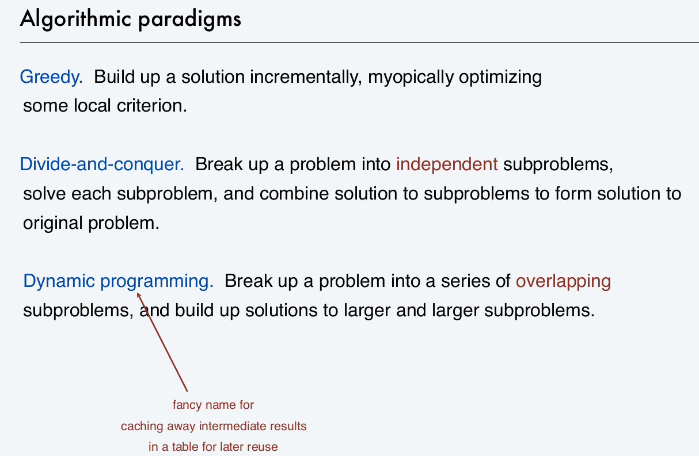
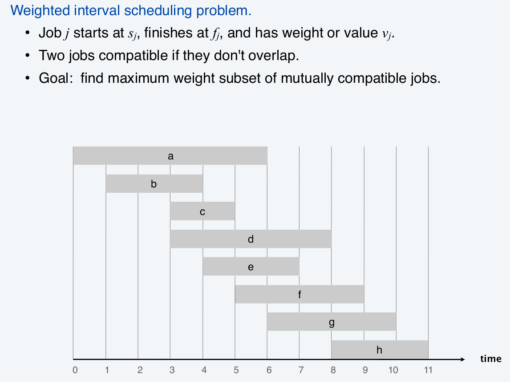
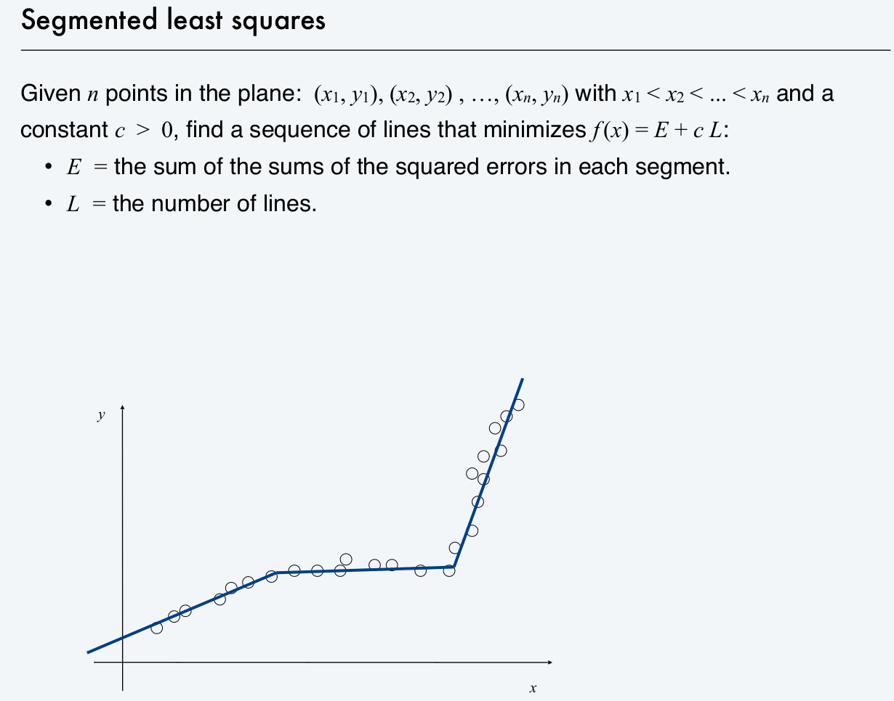
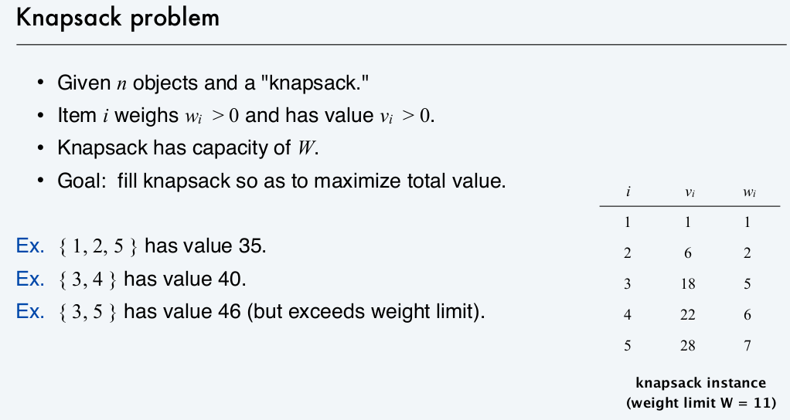
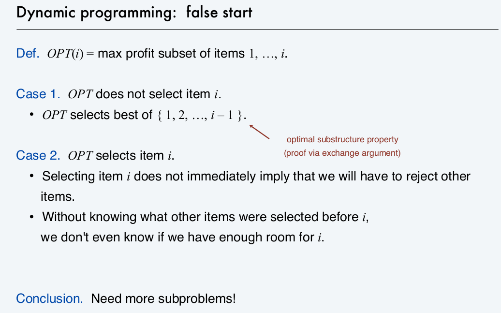

# Dynamic Programming

Dynamic programming is one of the most useful algorithms that usually constitute part of the solution. The theory of dynamic programming is easy to understand, but its application varies across very distinct scenarios, from 1-D to 2-D table, from direct and simple to relatively indirect and composite usage. This note summarizes typical usage of dyamic programming. Hopefully, this summary will include most common applications of this algorithm.

To start with, I'll review the *algorithm* course slides of dynamic programming.

We start talking about dynamic programming by comparing its general idea with other two classical algorithms, namely, greedy as well as divide-and-conquer.



==Dynamic programming can be applied to problems that can be incrementally solved by answering subproblems based on results of smaller subproblems.==

动态规划用于解决具有最优子结构（optimal substructure）的问题。

**Problem 1 Weighted Interval Scheduling**



DP optimal substructure: when computing $OPT(j)$, taking or not taking job j are compared to find optimal one. (kind of simliar to greedy here, optimal choice in each step leads to the global optimal)
$$
OPT(j) = 
\begin{cases}
0 & \text{if}~~j=0\\
\max\{OPT(p(j))+v(j), OPT(j-1)\} & \text{otherwise} \\
\end{cases}
$$
where $p(j)$ represents the latest compatible job with job j, and $v(j)$ represents the value (weight) of job j.

```c++
opt[j] = (j==0)?0:max(opt[p[j]]+v[j], opt[j-1]);
```

**Problem 2 Segmented Least Squares** 分段最小二乘



DP optimal substructure: when computing $OPT(j)$, we consider choosing the starting point $i$ of a line connecting point $j$. That is to say, we have a multi-way choice.
$$
OPT(j) =
\begin{cases}
0 & \text{if}~~j=0\\
\min_{1\leq i\leq j}\{e(i,j)+c+OPT(i-1)\} & \text{otherwise}
\end{cases}
$$
where $e(i,j)$ is the minimum sum of square errors for points $p_i, p_{i+1}, \ldots, p_j$. In another word, $e(i,j)$ is the cost of error if we connect $p_i$ to $p_j$ with a straight line.

For this algorithm, $e(i,j)$ is estimated before the DP part.

```c++
// assume e(i, j) is already estimated.
// c is the penalty of adding a new line 
opt[j] = 0;
for (int j = 0; j < n; ++ j) {
    opt[j] = INT_MAX;
    for (int i = 0; i <= j; ++ i)
        opt[j] = min(e[i][j]+c+opt[i-1], opt[j]));
}
```

**Problem 3 Knapsack Problem** 背包问题



Using only one iteration variable by imitating the weighted interval schduling is not enough. See the slide below. Therefore, we use another variable to represent the upper bound of weight.



DP optimal substructure:
$$
OPT(i, w)=
\begin{cases}
0 & \text{if}~~i=0\\
OPT(i-1, w) &\text{if}~~w(i) > w \\
\max\{OPT(i-1, w-w(i))+v(i), OPT(i-1, w)\} & \text{otherwise}
\end{cases}
$$
where $w(i)$ represents the weight of object $i$, and $v(i)$ represents the value of $i$.

```c++
for (int i = 0; i < n; ++ i) {
    for (int w = 0; w < W; ++ w) {
        if (i == 0) opt[i][w] = 0;
        else if (w[i] > w) opt[i][w] = opt[i-1][w];
        else opt[i][w] = max(opt[i-1][w-w[i]]+v[i], opt[i-1][w]);
    }
}
```

**Problem 4 RNA Seconday Structure**


## 5C: Longest Regular Bracket Sequence

[problem](https://codeforces.com/problemset/problem/5/C)

Feature: `dp[i]` represents some attribute of a sequence ending at index `i`, so that the result of a sequence starting at `i+1` can be combined with that of the sequence ending at `i`.

input `string s`

One of the solutions to 5C utilizes dynamic programming. In this solution, 1-D array `dp` is used as a constructive part to the whole solution. Specifically, `dp[i]` represents the length of valid regular bracket sequence ending with  `s[i]`. If there is no valid sequence ending with `s[i]`, then `dp[i]` should be set to 0. With this definition, for a close bracket `)` at `s[i]`, whose matching open bracket `(` is at `s[j]`, we have the relationship

```c++
dp[i] = (i-j+1) + ((j==0)?0:dp[j-1]);
```

, where `(i-j+1)` is the length of sequence from `j` to `i`, which must be valid since they are assumed to be matched. `dp[j-1]` is the length of valid string ending with `s[j-1]`. Since valid string ending with `s[j-1]` and starting with `s[j]` can comprise a new valid string of length `(i-j+1) + dp[j-1]`. 