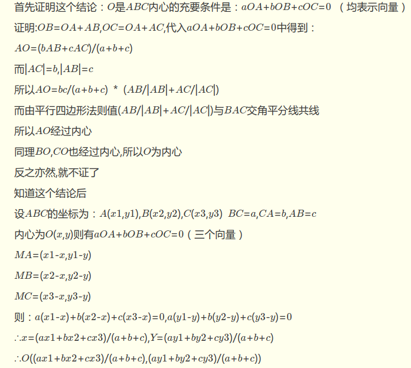
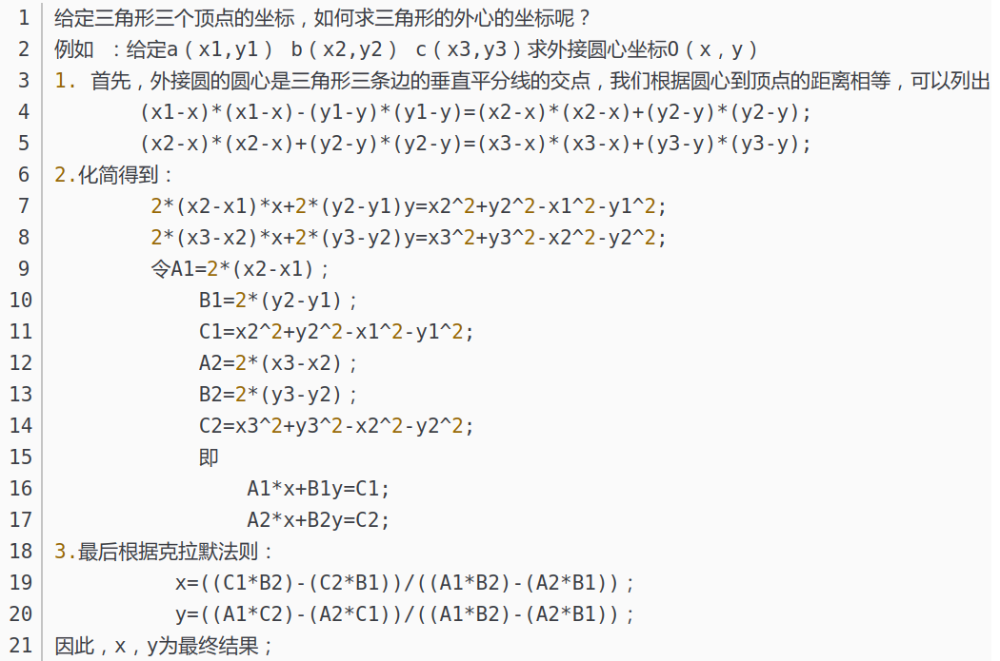

# Geometry

## Trick 1: 直线的表达式

直线的表达形式通常包括点斜式，斜截式，两点式，和截距式。非常常见的一般式（$Ax+By+C=0$）在此不予赘述。

###　点斜式

直线的斜率为$k$，经过点$P_1(x_1, y_1)$，则直线方程为
$$
y-y_1 = k(x-x_1)
$$
点斜式不能表式垂直于$x$轴的直线，因为此时斜率$k$为无穷大

### 斜截式

直线的斜率为$k$，截距为$b$，则直线方程为
$$
y = k\cdot x + b
$$

### 两点式

直线经过点$P_1(x_1, y_1)$和点$P_2(x_2, y_2)$，则直线方程为
$$
\frac{y-y_1}{y_2-y_1} = \frac{x-x_1}{x_2-x_1}
$$
两点式不能表示与坐标轴平行的直线

### 截距式

直线在$x$轴上的截距（横截距）为$a$，在$y$轴上的截距（纵截距）为$b$，则直线方程为
$$
\frac{x}{a} + \frac{y}{b} = 1
$$

## Trick 2: Triangle Centers

Refer to [link](https://www.mathopenref.com/trianglecenters.html)

### Incenter 内心，内切圆心，三内角角平分线交点

[Incenter](https://www.mathopenref.com/triangleincenter.html) is the intersection of the angle bisectors. To estimate the coordinate of the incenter given coordinates of vertices, we follow the proof below.



In short, given the coordinates of three vertices are $A(A_x, A_y)$, $B(B_x, B_y)$ and $C(C_x, C_y)$, then the coordinate of the incenter $O(O_x, O_y)$ is
$$
\begin{cases}
O_x = \frac{a\cdot A_x+b\cdot B_x+c\cdot C_x}{a+b+c} \\
O_y = \frac{a\cdot A_y+b\cdot B_y+c\cdot C_y}{a+b+c} \\
\end{cases}
$$
where $a=|BC|$, $b=|AC|$, and $c=|AB|$.

### Circumcenter 外心，外切圆心，三边中垂线交点

The [circumcenter](https://www.mathopenref.com/trianglecircumcenter.html) of a triangle is the point where the three perpendicular bisectors (中垂线) of a triangle meet. Given coordinates of three vertices, the proof below demonstrates how to estimate the circumcenter



The following codes estimate the circumcenter of a triangle given the coordinates of three vertices.

```c++
void circumcenter (long double & xc, long double & yc,
                long double x1, long double y1,
                long double x2, long double y2,
                long double x3, long double y3) {
    long double a1, b1, c1, a2, b2, c2;
    a1 = 2 * (x2 - x1);
    b1 = 2 * (y2 - y1);
    c1 = x2 * x2 + y2 * y2 - x1 * x1 - y1 * y1;
    a2 = 2 * (x3 - x2);
    b2 = 2 * (y3 - y2);
    c2 = x3 * x3 + y3 * y3 - x2 * x2 - y2 * y2;

    xc = ((c1 * b2) - (c2 * b1)) / ((a1 * b2) - (a2 * b1));
    yc = ((a1 * c2) - (a2 * c1)) / ((a1 * b2) - (a2 * b1));
}
```

### Centroid 重心，三边中线交点

### Orthocenter 垂心，三边之高交点


